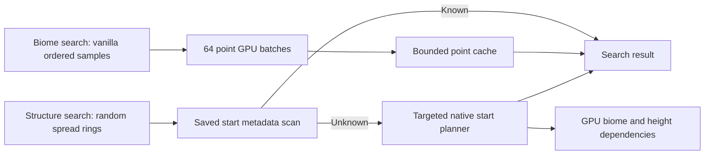

# Direct GPU locate queries

Biome locate previously avoided MCA assembly but requested a complete chunk's
quart biomes through `terrain_field`. Depending on the loaded profile, that
computed a neighboring cave/material tile. Structure locate inherited vanilla's
chunk-loading path, which could assemble and publish regions while testing
candidates.

The query path keeps the world seed and immutable loaded profile, evaluates only
requested coordinates/candidates, and never calls a region writer, block
assembler or chunk loader.

## Coordinates and parity

`retina_query_points` takes XYZ integer triples and returns biome registry indices
(`kind=0`) or exact pre-decoration terrain heights including lake shaping
(`kind=1`). Biomes normalize to Minecraft's global four-block quart lattice;
Y clamps to the world's generation bounds. Heights retain all local X/Z offsets.
The FFM bridge accepts at most 1,024 points and Rust splits work into batches of
64. The FIFO point cache holds 8,192 entries keyed by the complete terrain request,
profile handle, normalized position and query kind.

Queries run the same loaded climate/density programs, coast classification and
underground selection as terrain generation. A profile without generated cave
biomes returns surface IDs. Biome queries need height and, where applicable,
lake/coast dependencies; they cannot always evaluate a single independent noise
function. They omit material programs, cave voxel masks, decoration, NBT and MCA
compression. Low descriptor bits carry local offsets only for sparse queries,
leaving the existing interpreter, lake and density cache flags intact.

`RetinaBiomeSource.findClosestBiome3d` retains vanilla's candidate pool, spiral
columns, Y order, returned block coordinates and first-hit behavior. A batch can
evaluate up to 63 later samples before the first match is returned. Horizontal
biome searches use the point API through their resolver and preserve vanilla's
random sampling behavior.

## Structure lookup

Only structure sets exported by Retina's production profile participate. This
does not add support for strongholds or other unsupported structure families.
Search retains random-spread ring order, requested-holder order, placement locate
offsets and first successful radius semantics.

Saved metadata is authoritative, including an explicitly empty `starts` map.
The existing chunk scanner reads only data version and structure starts, applies
Minecraft's data fixer and never invokes `RegionFileStorage.read`. Read failures
propagate; they are not treated as a missing chunk. A per-search LRU retains at
most 8,192 scanned results.

For unknown chunks, `retina_query_structure_starts` accepts up to 64 triples of
chunk X/Z and native structure-set index. Rust checks placement, frequency and
exclusion rules, probes biomes on the GPU and uses the exact production piece
planner and shared start cache. It returns a definition index or -1. Valid jigsaw
planning can require height tiles and CPU template geometry; it does not place
blocks or serialize a chunk. Structure lookup with `createReference=true`, used
by explorer maps, retains vanilla's reference mutation path.

## Command scheduling

Interactive player `/locate biome` and `/locate structure` commands use one daemon
worker and a queue of eight searches. A player's newer request cancels their old
one, including a result already queued for delivery. The server thread captures
registry/world inputs and delivers Minecraft's normal clickable result. Bounds
and registry inputs are captured before worker execution; world close and
interruption abort the search between batches. Native work already submitted
finishes before cancellation is observed.

Console commands, command blocks and sources with command-result callbacks,
including `/execute store`, remain synchronous so their integer result semantics
are preserved. Interactive searches return acceptance immediately and report
their result later. A full queue reports a busy message; errors are logged and
reported on the server thread.

## Validation

`./gradlew locateTest` loads Minecraft registries and checks legacy/composed
profiles, negative/distant coordinates, local offsets, out-of-bounds Y clamping,
quart/height parity, repeated-query caching, vanilla biome scan order, empty
targets, saved positive/empty starts, propagated storage errors, unsupported
placements and world-close cancellation. It asserts zero assembled chunks and
temporary regions. `-PtestDatapack=/absolute/path/pack.zip` repeats those checks
with merged datapack registries.

`nativeGpuTest` additionally compares exact points with fields and physical coasts
in interpreter, wide-interpreter and specialized modes. `structureTest` queries
cold forced starts before production serialization and block generation for
villages, bastions, trial chambers, pyramids and huts. The Fabric JUnit test loads
the transformed locate command and verifies both injections apply.

These checks measure actual devices. Point batch latency depends on profile and
shader compilation; it is not a benchmark of a complete 6,400-block unsuccessful
search. Useful future improvements include sharing horizontal height/climate
dependencies across vertical samples, an interactive GPU priority lane and
adaptive batch sizes for near hits versus broad unsuccessful searches.

On Metal / Apple M4 Max, the serial 48-point fixture measured these biome-query
times with zero assembled regions (October 5, 2026). Cold here means the first
point request for a freshly registered profile; registry/profile export is
excluded. Warm means repeating those same points from the cache.

| Profile | First request | Cached repeat |
| --- | ---: | ---: |
| Vanilla, legacy density | 38.7 ms | 0.091 ms |
| Vanilla, composed density | 70.1 ms | 0.056 ms |
| Terralith, legacy density | 106.8 ms | 0.148 ms |
| Terralith, composed density | 150.5 ms | 0.492 ms |

The serial validation also passed `build`, `nativeGpuTest`, `structureTest`,
`shoreTest`, `previewTest` and `locateTest`, plus the Terralith `locateTest` run.
After integrating GPU region lighting, `build`, `locateTest`, `nativeGpuTest`,
`previewTest` and `lightingTest` passed again.
The build includes 63 native unit tests and the Fabric command injection test.
The fixture covers storage scans/data fixing, but does not drive an interactive
player session or claim a measured end-to-end command speedup.
